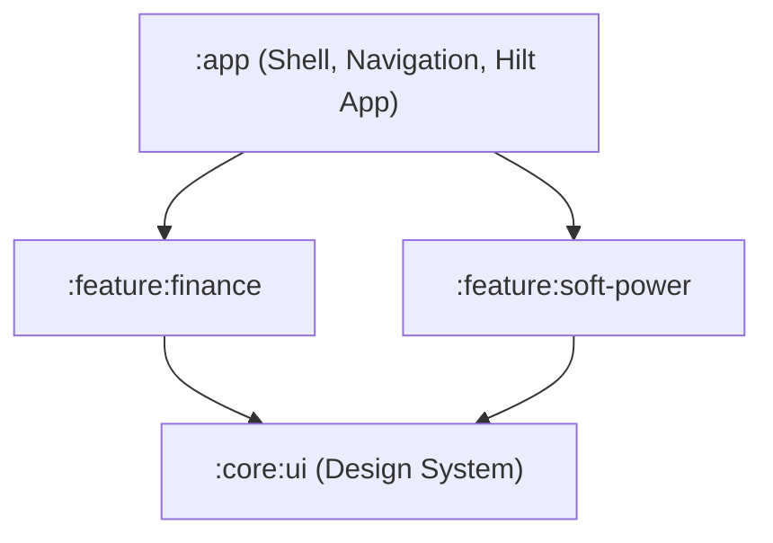

# OmniUtility - Platform Architecture & Feature Registry

Welcome to the **OmniUtility** codebase. This document serves as the single source of truth for the application's overall architecture, modular project structure, guidelines for adding new features, and the active feature registry.

---

## 1. High-Level Modular Architecture

OmniUtility is a multi-functional utility app designed with a **highly modularized Gradle architecture**. Features are separated into independent module packages to ensure clean boundaries, decoupled business logic, and fast compile times.

### Directory Structure
```
├── app/                  # Main application shell (binds all feature dependencies and routes)
├── core/                 # Shared core modules (common UI design system, shared utilities)
├── feature/              # Independent feature modules (isolated logic, DataStore, and resources)
│   ├── finance/          # Private AI Finance Manager
│   └── soft-power/       # Assistive Soft Power Screen Lock Button
└── docs/                 # Platform architecture, manuals, and design blueprints
```

### Dependency Flow


---

## 2. Navigation & App Routing

All feature routing is central and statically defined in the `:app` module using type-safe Compose Navigation 3:
* **MainActivity:** [MainActivity.kt](file:///Users/uyioriaghan/Documents/data/my_stuff/my_utility_app/app/src/main/java/com/omniutility/MainActivity.kt) configures edge-to-edge layout settings and initializes the Hilt container.
* **App Router:** Mapped in [Navigation.kt](file:///Users/uyioriaghan/Documents/data/my_stuff/my_utility_app/app/src/main/java/com/omniutility/Navigation.kt). Screen destinations are registered using type-safe serialization keys:
  ```kotlin
  @Serializable object Main
  @Serializable object SoftPower
  @Serializable object Finance
  ```

---

## 3. How to Add a New Feature

To add a brand-new feature to this multi-functional app:

1. **Create a Gradle Module:**
   * Create a new folder under `feature/` (e.g., `feature/my-new-tool`).
   * Configure it as an Android Library module by creating a standard feature-specific `build.gradle.kts`.
2. **Register in settings.gradle.kts:**
   * Append the new module path:
     ```kotlin
     include(":feature:my-new-tool")
     ```
3. **Link to App Dependencies:**
   * In `app/build.gradle.kts`, add the feature dependency:
     ```kotlin
     implementation(project(":feature:my-new-tool"))
     ```
4. **Create Navigation Key:**
   * In [Navigation.kt](file:///Users/uyioriaghan/Documents/data/my_stuff/my_utility_app/app/src/main/java/com/omniutility/Navigation.kt), define a new route key:
     ```kotlin
     @Serializable object MyNewTool
     ```
   * Register the screen layout block inside the `MainNavigation()` entry provider switcher.
5. **Add to Main Menu Dashboard:**
   * Add a menu item trigger linked to your new route inside [MainScreen.kt](file:///Users/uyioriaghan/Documents/data/my_stuff/my_utility_app/app/src/main/java/com/omniutility/ui/main/MainScreen.kt).

---

## 4. Current Feature Registry

### Feature A: Assistive Soft Power Screen Lock Button (`:feature:soft-power`)
* **Purpose:** Renders a persistent, translucent, floating accessibility overlay button that allows the user to lock their device screens safely.
* **Key Components:**
  * Uses Android `AccessibilityService` to call biometric-safe locking operations.
  * Manages settings onboarding (Accessibility and Overlay permissions deep-links).
  * Stores button configurations (transparency, margins) in an isolated `PreferencesDataStore`.

### Feature B: Private AI Finance Manager (`:feature:finance`)
* **Purpose:** A fully offline personal finance advisor and ledger.
* **Key Components:**
  * **Database Security:** SQLite encryption via SQLCipher, using a 256-bit passphrase generated securely on first boot using the Android Keystore.
  * **AI Statement Parser:** Native text extraction from PDFs (PdfBox) parsed offline into structured JSON transactions by Gemini Nano.
  * **AI Chat Advisor:** Contextual advisor utilizing Android AICore (Gemini Nano) for on-device inference, falling back to Gemini API (Studio Key) if Nano is offline.
  * **Keyboard Integration:** Resizes automatically with `Modifier.imePadding()` while the bottom navigation tab auto-hides beyond `100.dp` to prevent double-stacking.
  * **Ground-Truth Injections:** Injects programmatically calculated math metrics directly into chat prompts to prevent LLM miscounting.

### Feature C: Own Your Time (`:feature:own-your-time`)
* **Purpose:** A focus session manager and app blocker that intercepts unauthorized app usage to maintain user focus.
* **Key Components:**
  * **App Interception & Blocking:** Uses a `ForegroundService` observing `UsageStatsManager` to detect when prohibited apps are opened during active sessions. Real-time fun app usage tracking is calculated dynamically in memory via service wall-clock tracking (rather than delayed `UsageEvents` query cycles) to ensure instant blocking once the session fun budget is exceeded.
  * **Bypassing Background Restrictions:** Explicitly relies on the `SYSTEM_ALERT_WINDOW` (Display over other apps) permission to allow the background service to bounce the user back to the focus screen natively, overriding Android 10+ background activity start restrictions.
  * **Task Management:** Allows users to build lists of reusable "Task Templates" (text, deep links) tracked iteratively per session.
  * **Activity Backstack Manipulation:** Utilizes `launchMode="singleTask"` for the host activity, paired with `Intent.FLAG_ACTIVITY_NEW_TASK`, `FLAG_ACTIVITY_SINGLE_TOP`, and `FLAG_ACTIVITY_REORDER_TO_FRONT` flags, to securely bring the blocking overlay screen to the foreground and prevent back-navigation bypasses.
