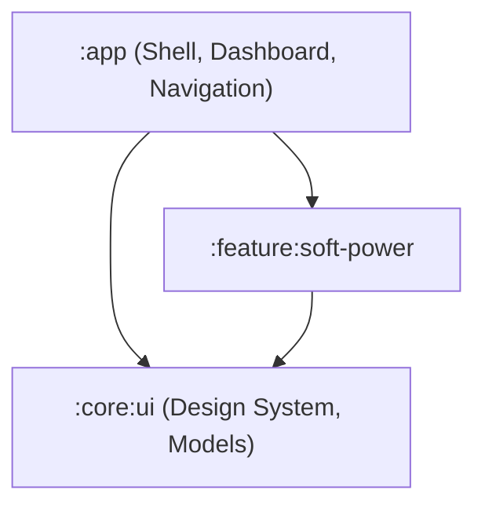

# Codebase Analysis & PRD Alignment

This document details the architecture, design choices, and feature implementation status of **OmniUtility**, cross-referencing the actual codebase against the requirements defined in [utility_platform_prd.md](file:///Users/uyioriaghan/Documents/data/my_stuff/my_utility_app/docs/utility_platform_prd.md).

---

## 1. Project Metadata & Technical Stack

| Attribute | PRD Specification | Current Implementation Status | Notes / Discrepancies |
| :--- | :--- | :--- | :--- |
| **Min SDK** | API 33 (Android 13.0+) | `minSdk = 33` | Match |
| **Compile / Target SDK** | API 34 (Android 14.0) | `compileSdk = 36`, `targetSdk = 36` | **Updated** to Android 16 (API 36) in Gradle configuration |
| **UI Framework** | Jetpack Compose (Material 3) | Jetpack Compose with Material 3 | Match |
| **Dependency Injection** | Hilt | **Manual DI Container (`AppContainer`)** | **Discrepancy:** The PRD specifies Hilt, but the codebase uses a manual constructor-injected container inside [OmniApplication.kt](file:///Users/uyioriaghan/Documents/data/my_stuff/my_utility_app/app/src/main/java/com/omniutility/OmniApplication.kt). No Hilt annotations (`@HiltAndroidApp`, `@AndroidEntryPoint`) or dependencies exist. |
| **Architecture Pattern** | Multi-Module Clean Architecture | Multi-Module (`:app`, `:core:ui`, `:feature:soft-power`) | Match |
| **Navigation Framework** | Static Routing | Compose Navigation 3 (`androidx.navigation3.runtime`) | **Note:** Uses typesafe destinations `Main` and `SoftPower` (typesafe serialization) |
| **State Persistence** | Jetpack Preferences DataStore | Isolated `PreferencesDataStore` per feature | Match |

---

## 2. Codebase Structure & Modules

The codebase aligns with the 3-module structure defined in the PRD:



### Module Descriptions & Code File Map
* **`:app`**:
  * [OmniApplication.kt](file:///Users/uyioriaghan/Documents/data/my_stuff/my_utility_app/app/src/main/java/com/omniutility/OmniApplication.kt): Entry point initializing the [AppContainer](file:///Users/uyioriaghan/Documents/data/my_stuff/my_utility_app/app/src/main/java/com/omniutility/AppContainer.kt) for manual DI.
  * [MainActivity.kt](file:///Users/uyioriaghan/Documents/data/my_stuff/my_utility_app/app/src/main/java/com/omniutility/MainActivity.kt): Hosts the Compose root and calls navigation.
  * [Navigation.kt](file:///Users/uyioriaghan/Documents/data/my_stuff/my_utility_app/app/src/main/java/com/omniutility/Navigation.kt) & [NavigationKeys.kt](file:///Users/uyioriaghan/Documents/data/my_stuff/my_utility_app/app/src/main/java/com/omniutility/NavigationKeys.kt): Implements Navigation 3 routing setup using typed keys.
  * [MainScreen.kt](file:///Users/uyioriaghan/Documents/data/my_stuff/my_utility_app/app/src/main/java/com/omniutility/ui/main/MainScreen.kt) & [MainScreenViewModel.kt](file:///Users/uyioriaghan/Documents/data/my_stuff/my_utility_app/app/src/main/java/com/omniutility/ui/main/MainScreenViewModel.kt): Dashboard UI displaying available utilities using [UtilityMetadata](file:///Users/uyioriaghan/Documents/data/my_stuff/my_utility_app/core/ui/src/main/java/com/omniutility/core/ui/UtilityMetadata.kt).
* **`:core:ui`**:
  * [UtilityMetadata.kt](file:///Users/uyioriaghan/Documents/data/my_stuff/my_utility_app/core/ui/src/main/java/com/omniutility/core/ui/UtilityMetadata.kt): Simplified data structure describing the metadata of a utility.
  * Theme resources under `theme/*`.
* **`:feature:soft-power`**:
  * [SoftPowerFeature.kt](file:///Users/uyioriaghan/Documents/data/my_stuff/my_utility_app/feature/soft-power/src/main/java/com/omniutility/feature/softpower/SoftPowerFeature.kt): Implements the permission onboarding UI (Display over other apps and Accessibility Access) and the customization sliders/buttons.
  * [SoftPowerAccessibilityService.kt](file:///Users/uyioriaghan/Documents/data/my_stuff/my_utility_app/feature/soft-power/src/main/java/com/omniutility/feature/softpower/service/SoftPowerAccessibilityService.kt): An `AccessibilityService` subclass that implements the required Lifecycle/SavedState/ViewModel owners to support rendering Jetpack Compose inside WindowManager.
  * [FloatingWindowManager.kt](file:///Users/uyioriaghan/Documents/data/my_stuff/my_utility_app/feature/soft-power/src/main/java/com/omniutility/feature/softpower/ui/FloatingWindowManager.kt): Manages the window lifecycle and coordinate calculations for the floating layout, including dragging and overshoot snapping.
  * [SoftPowerPreferences.kt](file:///Users/uyioriaghan/Documents/data/my_stuff/my_utility_app/feature/soft-power/src/main/java/com/omniutility/feature/softpower/data/SoftPowerPreferences.kt): Manages preferences loading and saving via Preferences DataStore.

---

## 3. Detailed Feature Analysis: Assistive Soft Power Button

### FR-1.1 Floating Trigger & FR-1.2 Draggable Snapping
* Implemented in [FloatingWindowManager.kt](file:///Users/uyioriaghan/Documents/data/my_stuff/my_utility_app/feature/soft-power/src/main/java/com/omniutility/feature/softpower/ui/FloatingWindowManager.kt) using a ComposeView inside custom `WindowManager` layout parameters.
* Touch handling (`onTouch`) captures `ACTION_DOWN`, `ACTION_MOVE`, and `ACTION_UP`.
* Snapping logic: Uses `ValueAnimator` with `OvershootInterpolator` on `ACTION_UP` to drag the view to the left or right margin depending on whether the center of the button is past the horizontal center of the screen.

### FR-1.3 Biometric-Safe Screen Locking
* Accomplished using:
  ```kotlin
  performGlobalAction(GLOBAL_ACTION_LOCK_SCREEN)
  ```
  in the service, which acts as a virtual power button click. This prevents invalidating biometrics (unlike DevicePolicyManager administration locking).

### FR-1.4 Feature Onboarding
* Screen [SoftPowerFeature.kt](file:///Users/uyioriaghan/Documents/data/my_stuff/my_utility_app/feature/soft-power/src/main/java/com/omniutility/feature/softpower/SoftPowerFeature.kt) listens to `ON_RESUME` events to dynamically check permissions:
  * `Settings.canDrawOverlays(context)`
  * Accessibility service enabled state (via checking active services in settings).
* Direct settings intent links are launched for user grant navigation if not already enabled.

### FR-1.5 Secure Screen Overlay Persistence
* Set up in [accessibility_service_config.xml](file:///Users/uyioriaghan/Documents/data/my_stuff/my_utility_app/feature/soft-power/src/main/res/xml/accessibility_service_config.xml):
  ```xml
  android:isAccessibilityTool="true"
  ```
  This is required for Android 13/14+ overlay permissions, preventing overlay dismissal during sensitive system screens.

---

## 4. Key Design and Code Observations

1. **Jetpack Compose in `AccessibilityService`**:
   * Rendering Jetpack Compose inside a `WindowManager` layout requires setting `LifecycleOwner`, `ViewModelStoreOwner`, and `SavedStateRegistryOwner` on the `ComposeView`. This is correctly implemented in `SoftPowerAccessibilityService` via initialization-level registration.
2. **System Gesture Exclusion**:
   * For Android 10+, [FloatingWindowManager.kt](file:///Users/uyioriaghan/Documents/data/my_stuff/my_utility_app/feature/soft-power/src/main/java/com/omniutility/feature/softpower/ui/FloatingWindowManager.kt#L142-L146) excludes the floating button area from system gestures via `systemGestureExclusionRects`, ensuring users don't trigger "back" gestures when dragging the button near margins.
3. **DataStore Isolation**:
   * Prefs are stored in `soft_power_settings.preferences_pb` file via feature-specific extension on `Context`, complying with data isolation standards.

---

## 5. Summary of Discrepancies and Code Concerns

1. **Dependency Injection**:
   * **Spec:** Hilt.
   * **Reality:** Manual Dependency Injection via application-scope container class (`AppContainer`).
2. **Missing Unit/UI Tests for feature module**:
   * While unit tests exist in `:app` (`MainScreenViewModelTest`), `:feature:soft-power` lacks dedicated tests for repository loading or gesture calculation logic.
