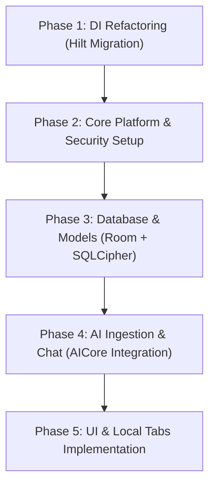

# Integration Plan: Privacy-First Offline AI Finance Manager

This document outlines the architectural decisions and execution plan to integrate the **Privacy-First Offline AI Personal Finance Manager** into the **OmniUtility** modular codebase. 

---

## 1. Architectural Decisions Summary

Based on target device optimizations (Google Pixel 8 Pro running Android 17) and code-quality considerations, the following design decisions were agreed upon during the grilling session:

| Component | Selected Strategy | Rationale |
| :--- | :--- | :--- |
| **Dependency Injection** | Hilt DI | Migrating from manual DI (`AppContainer`) to Hilt to manage database singletons and LLM engine lifecycles cleanly. |
| **On-Device AI Engine** | Android AICore (Gemini Nano) | Eliminates user-space LiteRT model weight downloads (~1.5GB overhead). Runs accelerated on the hardware Tensor NPU with zero client RAM footprint. |
| **Onboarding UX** | System Diagnostics Screen | Verifies AICore presence, registration, and model preparation status instead of a download progress indicator. |
| **Device Compatibility Guard** | Dashboard Lockout | The feature card will show a "Locked" visual state on unsupported hardware, displaying an educational dialog when tapped. |
| **Local Storage** | Room Database + SQLCipher | Provides typesafe object persistence and Flow capabilities while maintaining AES-256 encryption. Passphrase managed via Android Keystore. |
| **Feature Routing** | Isolated Local Navigation | Mapped as a single destination route in the main app nav; handles the internal 3-tab sub-navigation locally. |

---

## 2. Phased Implementation Plan

### Phase 1: Hilt DI Migration
* **Goal:** Remove [AppContainer.kt](file:///Users/uyioriaghan/Documents/data/my_stuff/my_utility_app/app/src/main/java/com/omniutility/AppContainer.kt) and set up compiler-safe dependency injection.
* **Tasks:**
  1. Add Hilt plugins and classpath dependencies to root and module Gradle files.
  2. Annotate [OmniApplication.kt](file:///Users/uyioriaghan/Documents/data/my_stuff/my_utility_app/app/src/main/java/com/omniutility/OmniApplication.kt) with `@HiltAndroidApp`.
  3. Annotate [MainActivity.kt](file:///Users/uyioriaghan/Documents/data/my_stuff/my_utility_app/app/src/main/java/com/omniutility/MainActivity.kt) with `@AndroidEntryPoint`.
  4. Migrate [SoftPowerSettingsRepository](file:///Users/uyioriaghan/Documents/data/my_stuff/my_utility_app/feature/soft-power/src/main/java/com/omniutility/feature/softpower/data/SoftPowerPreferences.kt#L18) to Hilt using constructor injection.

### Phase 2: Core Platform & Security Setup
* **Goal:** Configure AICore access checks and keystore-based passphrase generation.
* **Tasks:**
  1. Add dependencies for Google AI Client SDK.
  2. Implement `AICoreManager` to check if Gemini Nano is supported and ready.
  3. Set up the Android Keystore key generation pipeline to securely generate the 256-bit database encryption passphrase on first boot.

### Phase 3: Database & Room Entities
* **Goal:** Implement the local encrypted database schema.
* **Tasks:**
  1. Define the four Room entities: `AccountContainer`, `TransactionRecord`, `MemoryLookupEntity`, and `FinancialCompassGoal`.
  2. Configure SQLCipher `SupportOpenHelper.Factory` to open the Room database with the keystore passphrase.
  3. Implement the DAOs (Data Access Objects) with Flow support.

### Phase 4: AI Ingestion Pipeline
* **Goal:** Extract, clean, and structure statement transactions offline.
* **Tasks:**
  1. Add PdfBox dependency for native statement text extraction.
  2. Implement text parsing helper functions (Regex cleanups).
  3. Create prompts for Gemini Nano to take raw text slices and output structured JSON transaction lists matching the entity schemas.
  4. Write the background `ForegroundService` to handle parsing larger statements with a progress notification.

### Phase 5: Finance UI Dashboard & Tabs
* **Goal:** Build the user-facing 3-tab layout.
* **Tasks:**
  1. Update [MainScreen.kt](file:///Users/uyioriaghan/Documents/data/my_stuff/my_utility_app/app/src/main/java/com/omniutility/ui/main/MainScreen.kt) to display the locked state if unsupported.
  2. Create the Finance navigation node containing the 3 tabs:
     * **Home Dashboard:** Financial Delta Ledger, Vault Drop-Zone FAB (triggers statement ingestion sheet).
     * **Analytics:** Charts and contextual chat overlay.
     * **Vault Setup:** Goals configuration and account slots.
