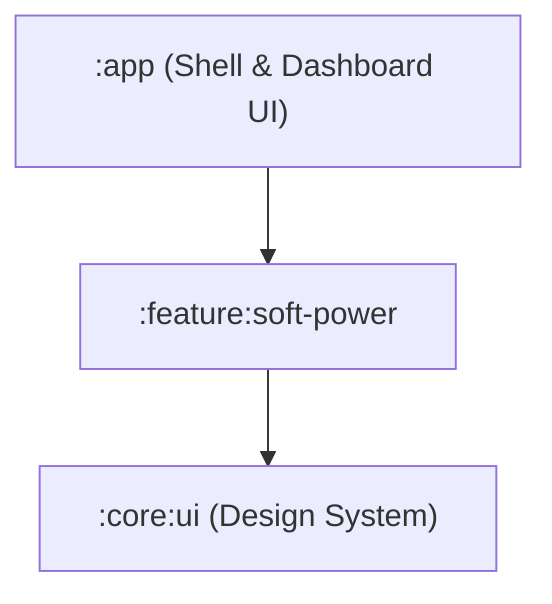

# Product Requirement Document (PRD)
## Modular Android Utility Platform ("OmniUtility")

| Attribute | Specification |
| :--- | :--- |
| **Target OS / Min SDK** | API 33 (Android 13.0+) to API 34 (Android 14.0+) |
| **UI Framework** | Jetpack Compose (Material 3) |
| **Dependency Injection** | Hilt |
| **Architecture Pattern** | Multi-Module Clean Architecture (Static Routing) |
| **State Persistence** | Jetpack Preferences DataStore (Isolated per feature) |
| **Document Version** | v2.1 (Simplified Production Blueprint) |

---

## 1. Objective & Platform Scope
The purpose of this project is to build a high-performance, modular Android utility application. The app will open to a central Dashboard UI listing all available functions. 

The first utility is the **Assistive Soft Power Button**, which renders a persistent, translucent, floating overlay to trigger a biometric-safe lock screen command.

---

## 2. Multi-Module Project Structure
The codebase uses a simplified multi-module Gradle layout:



### Modules
* **`:app`**: Contains the Application class, Hilt bindings, Navigation graph, and the main Dashboard screen.
* **`:core:ui`**: Centralized Material 3 colors, custom shapes, and typography.
* **`:feature:soft-power`**: The Soft Power Button feature logic, its settings DataStore, its overlay service, and its permission onboarding UI.

---

## 3. Navigation & Dashboard (Zero-Bloat Integration)
Instead of a complex plugin registry, we map screens directly in the `:app` navigation graph. 

### Feature Contract (Simplified)
To keep the dashboard consistent, features implement a minimal definition interface in `:core:ui` or `:core:common`:

```kotlin
package com.omniutility.core.ui

import androidx.compose.ui.graphics.vector.ImageVector

data class UtilityMetadata(
    val id: String,
    val title: String,
    val description: String,
    val icon: ImageVector,
    val route: String
)
```

The Dashboard UI simply renders a list of these static metadata objects, navigating directly to the feature's route using Compose Navigation.

---

## 4. Feature Specification: Assistive Soft Power Button (`:feature:soft-power`)

### 4.1 Functional Requirements
* **FR-1.1 Floating Trigger:** Render a persistent translucent overlay button.
* **FR-1.2 Draggable Bounds:** Enable drag gestures with smooth snapping to the nearest lateral screen margin (left/right) on release (`ACTION_UP`).
* **FR-1.3 Biometric-Safe Locking:** Call `performGlobalAction(GLOBAL_ACTION_LOCK_SCREEN)` from the feature's `AccessibilityService` context.
* **FR-1.4 Feature Onboarding:** A Compose screen that checks settings permissions ("Display over other apps" and "Accessibility Access") and deep-links the user to the system settings pages if permission is missing.
* **FR-1.5 Secure Screen Overlay Persistence:** The Accessibility Service configuration must strictly declare `android:isAccessibilityTool="true"` to bypass aggressive OS behavior that would otherwise forcibly hide the floating button when the user navigates into secure Android system settings.

---

## 5. Persistence & Memory
* **DataStore:** The `:feature:soft-power` module maintains its own isolated `PreferencesDataStore` to save configuration parameters (e.g., button transparency, snap duration) independently of other features.
* **Memory Limits:** The background Accessibility Service overlay lifecycle must run leak-free and under a 15MB aggregate RAM heap footprint.
